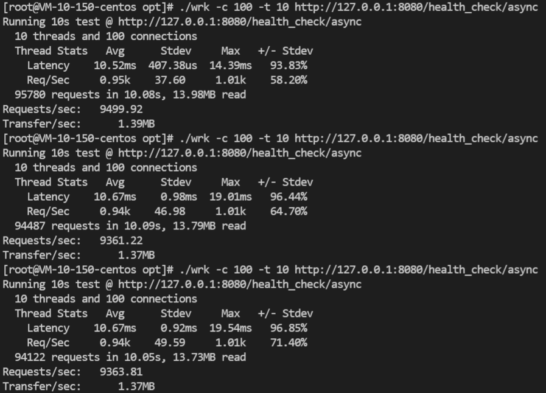
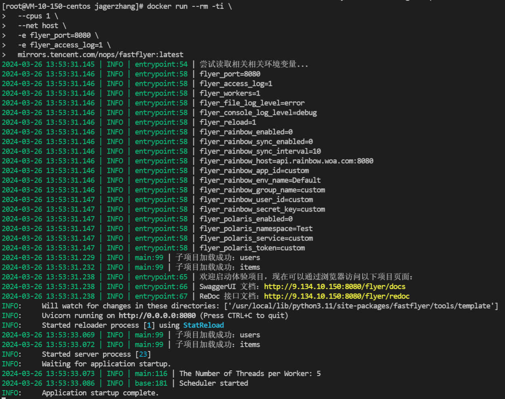
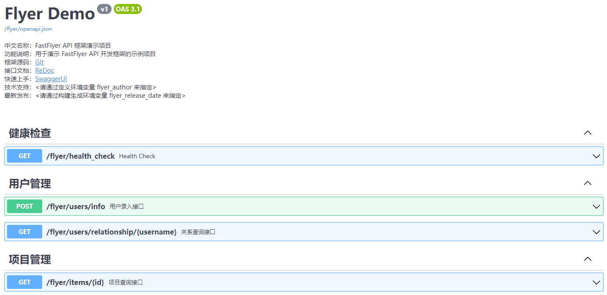

## FastFlyer: 轻量级 API 开发框架


## 项目介绍
FastFlyer 是基于 FastAPI 设计的轻量级 API 开发框架，是[Flyer](https://github.com/jagerzhang/flyer)的迭代升级版本。该框架全面升级为 SDK 即装即用方式，和业务代码隔离，再无框架版本难以更新维护问题。同时内置了业务项目初始化生成等辅助工具，让研发人员只需专注于业务逻辑的实现，实现真正的开箱即用体验。

FastFlyer为开发者提供了便利的开发环境和工具，使其能够更高效地进行业务逻辑的实现，包括但不限于：

- 集成了一系列公共组件，且可以继续按需整合，如Redis、MySQL、Kafka
- 集成了鹅厂内部实用的研效组件，包括北极星服务发现、日志汇、监控宝、七彩石等（外部版本已剔除）。


## 性能测试
单核单进程模式，FastFlyer 空载性能在 9000+ QPS，基本可以满足绝大部分运维场景。压测方式如下：

### 启动服务
```shell
docker run --rm -ti \
  --cpus 1 \
  --net host \
  -e flyer_port=8080 \
  -e flyer_access_log=0 \
  jagerzhang/fastflyer:latest
```

### 启动压测
```shell
[root@VM-10-150-centos opt]# ./wrk -c 100 -t 10 http://127.0.0.1:8080/health_check/async
Running 10s test @ http://127.0.0.1:8080/health_check/async
  10 threads and 100 connections
  Thread Stats   Avg      Stdev     Max   +/- Stdev
    Latency    10.52ms  407.38us  14.39ms   93.83%
    Req/Sec     0.95k    37.60     1.01k    58.20%
  95780 requests in 10.08s, 13.98MB read
Requests/sec:   9499.92
Transfer/sec:      1.39MB
```

### 压测结果


## 快速体验
```shell
docker run --rm -ti \
  --cpus 1 \
  --net host \
  -e flyer_port=8080 \
  -e flyer_access_log=1 \
  jagerzhang/fastflyer:latest
```

成功启动预览如下：



此时，打开浏览器访问上图提示的地址即可看到 SwaggerUI 和 Redoc 内置文档：




## 正式开发
### 项目结构说明
以下是SDK自动生成的初始代码的结构说明，第一次接触建议认真阅读：
```shell
.
├── app                            # 应用目录，FastFlyer 将自动加载本目录下符合框架规范的应用。
│   ├── __init__.py                # 导入文件，将目录加入 PYTHOHPATH，用于缩短应用内部包导入，from items.module import xxxx
│   ├── items                      # 演示应用1：项目管理，主要演示单个路由文件如何导入
│   │   ├── __init__.py            # 应用入口，这里必须导入路由对象：from .router import router ，注意最终对象必须为 router，框架仅支持加载名为 router 的路由实例对象
│   │   ├── module.py              # 逻辑模块文件
│   │   ├── README.md              # 应用自述文件
│   │   ├── router.py              # 应用路由定义
│   │   └── schema.py              # 应用输入输出参数定义
│   └── users                      # 演示项目2：用户管理，主要演示多个路由文件如何聚合给框架加载
│       ├── __init__.py            # 应用入口，这里必须导入路由对象：from .routers import router ，注意最终对象必须为 router，框架仅支持加载名为 router 的路由实例对象
│       ├── modules                # 逻辑模块目录
│       │   ├── __init__.py        # 包入口文件，必须存在
│       │   ├── relationship.py    # 用户关系逻辑代码
│       │   └── userinfo.py        # 用户信息逻辑代码
│       ├── README.md              # 应用自述文件
│       ├── routers                # 应用路由目录
│       │   ├── __init__.py        # 应用入口，这里有别于演示应用1，这里有多路由文件的聚合逻辑，如果是多路由方式请仔细查看这个文件的实现方式
│       │   ├── relationship.py    # 用户关系路由定义
│       │   └── userinfo.py        # 用户信息路由定义
│       └── schemas                # 应用输入输出参数定义文件夹
│           ├── __init__.py        # 包入口文件，必须存在
│           ├── relationship.py    # 用户关系相关接口参数定义
│           └── userinfo.py        # 用户信息相关接口参数定义
├── docker                         # 存放容器启动配置脚本等
│   ├── docker-entrypoint.sh       # 容器启动前置脚本
│   └── health_check.sh            # 健康检查脚本（针对于北极星方式）
├── Dockerfile                     # Docker 镜像构建脚本
├── __init__.py                    # SDK默认生成的空文件，可以删除
├── main.py                        # 项目入口文件，正常无需改动
├── README.md                      # 框架自动生成的文档，可以根据实际情况修改
├── requirements.txt               # 除SDK之外的业务项目依赖包，默认为空，可根据情况添加，建议带上版本号
├── settings.py                    # 项目基础配置，继承SDK框架基础配置，可以覆盖SDK配置
├── start-reload.sh                # 开发环境启动脚本，基于uvicorn，支持热加载特性
├── start.sh                       # 生产环境启动脚本，基于gunicorn
├── ctrl.sh                       # 开发环境辅助脚本，仅支持Docker环境
├── .gitignore                     # git忽略配置
├── .dockerignore                  # docker构建忽略配置
└── .code.yml                      # CodeCC 白名单配置
```

### 创建项目

`注：Python要求3.6.8以上版本，推荐 Python 3.8以上版本，如果出现依赖报错，可以 case by case 解决。`

#### 安装框架SDK
我们在本地安装 FastFlyer 确保 IDE 能够正常提示.

```shell
# 安装或更新 fastflyer
pip3 install --upgrade fastflyer
```

#### 创建全新项目
 
仅适用于从0开始的项目，`已有代码请忽略此步骤`。

```
# 确定一个代码目录并进入
cd /data/my_project/<new_project>

# 生成初始项目代码
fastflyer create_app

# 上传代码到既定代码库（请自行修改仓库地址，如果没有请自行前往工蜂自行）
git init --initial-branch=master
git remote add origin https://github.com/yourname/<new_project>.git
git add .
git commit -m "Initial commit"
git push --set-upstream origin master

# 创建个人开发分支
git checkout feature/xxxxxx
```

#### 克隆已有项目
如果是已有项目代码，请直接克隆，并切换到所需要的开发分支即可：
```
cd /data/my_project
git clone https://github.com/yourname/<new_project>.git
cd <new_project>
git checkout feature/xxxxxx
```

### 基于Docker搭建开发环境

框架已自动在代码根目录生成开发环境辅助脚本：`dev_ctrl.sh`，可用于快速控制开发环境。

#### 参数说明
```
欢迎使用 FastFlyer 开发环境辅助工具。

用法: ./dev_ctrl.sh <OPTION>
命令:
     start        启动开发容器
     show [D]     查看开发容器
     login        进入开发容器
     update       更新容器插件
     restart      重启开发容器
     reset        重建开发容器
     destroy      销毁开发容器
     log [COUNT]  查看容器日志
```

#### 运行服务

```shell
# 进入项目代码根目录
cd /data/my_project/<new_project>

# 一键拉起开发容器
./dev_ctrl.sh start
```

### 基于Linux搭建开发环境（不推荐）
已经执行过上文SDK安装，可以直接如下启动服务：
```
cd /data/my_project/<new_project>
./start-reload.sh
```

## 内建功能

`注：框架内建功能将持续更新。`

### 获取变量
```python
from os import getenv
from fastflyer import logger

custom_env_name = getenv("custom_env_name", "default_value")
logger.info(f"custom_env_name：{custom_env_name}")
```
`注：框架会将七彩石变量注入到环境变量中，因此可以用 getenv 获取。在启用定时同步后，这个方法能实时获取到七彩石最新配置。`

### 日志打印
```python
from fastflyer import logger

# 打印文本
logger.debug("DEBUG级别")
logger.info("INFO级别")
logger.warn("WARN级别")
logger.error("ERROR级别")

# 启用日志汇之后，可以传入字典消息，如果需要再日志汇做结构化解析，则需要先json.dumps
import json
logger.info(json.dumps({"field": "123"}))
```

### HTTP请求
框架基于`httpx`和`tenacity`分别封装了同步和异步请求，集成了失败重试和日志记录（支持日志汇）等机制，推荐使用。

**同步请求**

在线程开发模式中，推荐使用同步请求。

```python
from fastflyer import logger
from fastflyer import Client

# 发起 GET 请求示例
url = "https://httpbin.org/get"
headers = {"User-Agent": "My User Agent"}
params = {"param1": "value1", "param2": "value2"}
requests = Client()
response = requests.get(url, headers=headers, params=params)
print(response.status_code)
print(response.text)

# 发起 POST 请求示例
url = "https://httpbin.org/post"
payload = {"key": "value"}
response = requests.post(url, json=payload)
print(response.status_code)
print(response.text)

```

**异步请求**

在协程开发模式中，须使用异步请求。
```python
from fastflyer import logger
from fastflyer import AsyncClient

# 变量定义略
async def test():
  aiorequests = AsyncClient()
  resp = await aiorequests.get(url=url, headers=headers)
  if resp.status_code != 200:
      logger.error("请求失败")
  # 其他内容略
```

**自定义重试**

可以在初始化Client的时候传入重试参数：

```python
from fastflyer import Client

REQUEST_RETRY_CONFIG = {
        "stop_max_attempt_number": 3,  # 最大重试 3 次
        "stop_max_delay": 60,  # 最大重试耗时 60 s
        "wait_exponential_multiplier": 2,  # 重试间隔时间倍数 2s、4s、8s...
        "wait_exponential_max": 10  # 最大重试间隔时间 10s
}

requests = Client(**REQUEST_RETRY_CONFIG)
```

**预埋自定义设置**

可以在初始化Client的时候传入任意符合HTTPx插件的请求参数，包括请求超时、自定义头部等：

```python
from fastflyer import Client
requests = Client(timeout=60, headers={"content-type": "application/json"})
```

注：HTTP请求的更多介绍请阅读：[fastkit/httpx](https://git.woa.com/nops/framework/fastkit/tree/master/fastkit/httpx)

### 公共组件
对于公共组件的对接，建议以类的方式将初始化写到项目的 settings.py，以下为示例代码：

#### Redis

```python
# settings.py

from fastflyer.cache import get_redis_pool

class Cache:
    # 初始化Redis
    redis_host = getenv("flyer_redis_host", "localhost")
    redis_port = getenv("flyer_redis_port", 6379)
    redis_pass = getenv("flyer_redis_pass", "")
    redis_db = getenv("flyer_redis_db", 1)
    redis_pool = get_redis_pool(redis_host, redis_port, redis_pass, redis_db)

# 业务代码
from <app_dir>.settings import Cache

Cache.redis_pool.set("a", 1)
Cache.redis_pool.get("a")
```

#### MySQL

##### SQLAlchemy

```python
# 在 项目 settings.py 初始化 DataBase
from fastflyer.database import get_mysql_pool


class DataBase:
    # 如果启用 MySQL 请取消注释
    db_user = getenv("flyer_db_user", "root")
    db_pass = getenv("flyer_db_pass", "")
    db_host = getenv("flyer_db_host", "localhost")
    db_port = getenv("flyer_db_port", 3306)
    db_name = getenv("flyer_db_name", "flyer")
    db_chartset = getenv("flyer_db_chartset", "utf8")
    db_recycle_rate = int(getenv("flyer_db_recycle_rate", 900))
    db_pool_size = int(getenv("flyer_db_pool_size", 32))
    db_max_overflow = int(getenv("flyer_threads", 64))
    mysql_pool = get_mysql_pool(db_user, db_pass, db_host, db_port,
                                     db_name, db_recycle_rate, db_pool_size,
                                     db_max_overflow)

# db_tables.py 定义表结构 
# -*- coding: utf-8 -*-
from sqlalchemy import Column, String, Integer, Text, Boolean
from sqlalchemy.ext.declarative import declarative_base

Base = declarative_base()


class UserCallBackInfo(Base):
    """ 获取用户登记的回调信息
    """
    __tablename__ = "t_table_name" # 自定义表名
    id = Column(Integer, primary_key=True, index=True)
    string_field = Column(String(64),
                     nullable=False,
                     unique=True,
                     index=True,
                     comment="字符串字段")
    int_field = Column(Integer,
                       nullable=False,
                       default=0,
                       comment="整型字段")
    bool_filed = Column(Boolean(), default=True, comment="Bool类型字段")
    comment = Column(Text, nullable=False, comment="Text类型字段")
    # 其他请查询手册

    def to_dict(self):
        return {c.name: getattr(self, c.name)
                for c in self.__table__.columns}
```

##### DataSet

官方文档：[https://dataset.readthedocs.io/en/latest/](https://dataset.readthedocs.io/en/latest/)

简单进行了封装，加入了重连、重试等机制（官方版本的`mysql_ping`未达预期），用法如下：


```python
# 在 项目 settings.py 初始化 DataBase（需要在七彩石或环境变量中配置初始化相关变量）
from fastflyer.database import get_dataset_pool 
# 初始化 dataset 

class DataBase:
    # 如果启用 MySQL 请取消注释
    db_user = getenv("flyer_db_user", "root")
    db_pass = getenv("flyer_db_pass", "")
    db_host = getenv("flyer_db_host", "localhost")
    db_port = getenv("flyer_db_port", 3306)
    db_name = getenv("flyer_db_name", "flyer")
    db_chartset = getenv("flyer_db_chartset", "utf8")
    db_recycle_rate = int(getenv("flyer_db_recycle_rate", 900))
    db_pool_size = int(getenv("flyer_db_pool_size", 32))

    data_set = get_dataset_pool(db_host, db_port, db_name, db_user, db_pass,
                                db_recycle_rate, db_pool_size)

data_set = get_dataset_pool(db_user, db_pass, db_host, db_port, db_name)
table = data_set["表名"]


# 具体逻辑代码文件：增删改查代码示例：
from dataset import Table
from <app>.settings import DataBase


class DemoClass:
    """
    演示代码
    """
    def __init__(self) -> None:
        # 定义为 Table，让IDE可以自动提示函数
        self.db_set: Table = DataBase.data_set["表名"]

    def upsert(self):
        """
        插入或更新数据
        """
        row = {"key_item": 0, "item1": 1, "item2": 2}
        self.db_set.upsert(row, keys=["key_item"])

    def upsert_many(self):
        """
        批量插入或更新数据
        """
        row = [{"key_item": 0, "item1": 1, "item2": 2}, {"key_item": 1, "item1": 2, "item2": 3}]
        self.db_set.upsert_many(row, keys=["key_item"])

    def select(self):
        """
        查询数据
        """
        row = {"key_item": 0, "item1": 1, "item2": 2}
        row["_limit"] = 100
        row["_offset"] = 0
        row["order_by"] = "key_item"
        result = self.db_set.find(**row)
        data = [item for item in result]
        print(data)

    def select_one(self):
        """
        查询1条数据
        """
        row = {"key_item": 0, "item1": 1, "item2": 2}
        row["order_by"] = "key_item"
        result = self.db_set.find_one(**row)
        print(result)

    def delete(self):
        """
        删除数据
        """
        row = {"key": "value"}
        result = self.db_set.delete(**row)

        if result == 0:
            print("未匹配到数据")
        
        print(result)

```

## 环境变量
FastFlyer 支持通过七彩石或环境变量来修改各种配置，`生效优先级：七彩石 > 环境变量`。

### 框架基础配置
 **环境变量**                             | **是否必须** | **可选属性**                                | **默认值**                  | **变量说明**                                    
--------------------------------------|----------|-----------------------------------------|--------------------------|---------------------------------------------
 **flyer_host**                       | 可选       | N/A                                     | 0.0.0.0                  | 接口绑定IP                                      
 **flyer_port**                       | 可选       | N/A                                     | 8080                     | 接口绑定端口                                      
 **flyer_base_url**                   | 可选       | /[a-zA-Z0-9\._\-]$                      | /flyer                   | 服务地址前缀                                      
 **flyer_version**                    | 可选       | NA                                      | v1                       | 服务版本                                        
 **flyer_reload**                     | 可选       | 1/0                                     | 0                        | 支持代码热加载，一般只在开发环境启用                          
 **flyer_workers**                    | 可选       | ≥1                                      | 1                        | 工作进程数量                                      
 **flyer_threads**                    | 可选       | ≥5                                      | 5                        | 工作线程数量                                      
 **flyer_worker_connections**         | 可选       | ≥1                                      | 1000                     | 最大客户端并发数量                                   
 **flyer_enable_max_requests**        | 可选       | ≥0                                      | 0                        | 打开自动重启机制，除非有内存泄露，否则不推荐                      
 **flyer_max_requests**               | 可选       | ≥0                                      | 0                        | 重新启动之前，工作将处理的最大请求数                          
 **flyer_max_requests_jitter**        | 可选       | ≥0                                      | 0                        | 要添加到 max_requests 的最大容忍buffer               
 **flyer_timeout**                    | 可选       | ≥0                                      | 60                       | 超过这么多秒后worker进程将重新启动，可能会出现502，好处是能够定期释放僵尸逻辑 
 **flyer_graceful_timeout**           | 可选       | ≥0                                      | 1                        | 优雅退出时间，默认为1S，加速开发环境重载，生产环境建议配置10S以上                               
 **flyer_keepalive**                  | 可选       | ≥0                                      | 5                        | 在 keep-alive 连接上等待请求的秒数                     
 **flyer_console_log_level**          | 可选       | debug/info/warn/error                   | info                     | 定义控制台日志级别                                   
 **flyer_file_log_level**             | 可选       | debug/info/warn/error                   | info                     | 定义日志文件的日志级别                                 
 **flyer_access_log**                 | 可选       | 1/0                                     | 1                        | 是否记录请求日志                                    
 **flyer_access_logfile**             | 可选       | N/A                                     | -                        | 定义Gunicorn请求日志文件的位置，适用于生产环境，默认输出到控制台      

### 启用七彩石配置
**注：七彩石中可以配置除以下配置之外的所有变量，生效优先级大于启动环境变量**

 **环境变量**                             | **是否必须** | **可选属性**                                | **默认值**                  | **变量说明**                                    
--------------------------------------|----------|-----------------------------------------|--------------------------|---------------------------------------------
 **flyer_rainbow_enabled**            | 可选       | 0/1                                     | 0                        | 选择启用七彩石配置                                   
 **flyer_rainbow_host**               | 可选       | N/A                                     | api.rainbow.woa.com:8080 | 七彩石服务主机地址                                   
 **flyer_rainbow_app_id**             | 必须       | N/A                                     |                          | 七彩石应用ID                                     
 **flyer_rainbow_user_id**            | 必须       | N/A                                     |                          | 七彩石用户ID                                     
 **flyer_rainbow_secret_key**         | 必须       | N/A                                     |                          | 七彩石用户密钥                                     
 **flyer_rainbow_group_name**         | 必须       | N/A                                     |                          | 七彩石配置组名称                                    
 **flyer_rainbow_env_name**           | 必须       | N/A                                     |                          | 指定七彩石环境                                     
 **flyer_rainbow_sync_enabled**       | 可选       | 0/1                                     | 1                        | 启用七彩石配置自动同步                                 
 **flyer_rainbow_sync_interval**      | 可选       | ≥5                                      | 10                       | 七彩石配置自动同步的间隔                                

### 启用北极星配置
**需要启用`北极星`服务发现请添加如下配置：**

 **环境变量**                             | **是否必须** | **可选属性**                                | **默认值**                  | **变量说明**                                    
--------------------------------------|----------|-----------------------------------------|--------------------------|---------------------------------------------
 **flyer_polaris_enabled**            | 可选       | 1/0                                     | 0                        | 是否启用北极星                                     
 **flyer_polaris_namespace**          | 可选       | Development/Test/Pre-release/Production |                          | 指定北极星的命名空间                                  
 **flyer_polaris_service**            | 可选       | N/A                                     |                          | 指定北极星注册的服务名字                                
 **flyer_polaris_token**              | 可选       | N/A                                     |                          | 指定北极星服务名字对应的 token                          
 **flyer_polaris_heartbeat_interval** | 可选       | ≥5                                      | 5                        | 指定北极星心跳的间隔秒数                                
 **flyer_polaris_metadata_XXXXXXX**   | 可选       | N/A                                     |                          | 自定义北极星服务的 metadata 标签，XXXXXXX是标签名           


### 启用日志汇配置
 **环境变量**                             | **是否必须** | **可选属性**                                | **默认值**                  | **变量说明**                                    
--------------------------------------|----------|-----------------------------------------|--------------------------|---------------------------------------------
 **flyer_zhiyan_log_enabled**         | 可选       | 1/0                                     | 0                        | 是否上报访问日志到智研                                 
 **flyer_zhiyan_log_topic**           | 可选       | N/A                                     |                          | 智研日志 Topic                                  
 **flyer_zhiyan_log_proto**           | 可选       | tcp/udp/dev                             |                          | 智研日志上报方式，dev指的是开发环境                         
 **flyer_zhiyan_my_ip**               | 可选       | N/A                                     |                          | 指定智研上报的本地IP地址，默认获取本机IP                      


## 返回码

`FastFlyer` 参考 `HTTP` 标准返回码定义了一套消息内容返回码（即 `Body` 里面的 `code` 对应的值），其中 `20x`、`30x`、`40x`、`50x`等标准`HTTP`状态码沿用 `Starlettle`内置变量。

此外 `FastFlyer` 框架还自定义了一组第三方服务错误返回码：`60x`，可以用于表示请求第三方服务出现了异常，开发者可以根据实际情况使用。

## 示例代码
```python
from fastflyer import status
from fastflyer.schemas import DataResponse
from fastflyer import APIRouter

router = APIRouter(tags=["Demo示例"])


@router.get("/demo", response_model=DataResponse, summary="Demo接口")
async def demo(id: int):
    """
    演示接口：信息查询
    ---
    - 附加说明: 这是一个演示接口。
    """
    return {"code": status.HTTP_200_OK, "data": {"itemId": id}}
```

### 返回码清单

#### 正常类返回码：20x

| 状态码   | 变量名                  | 说明                     |
|----------|-------------------------|--------------------------|
| 200      | HTTP_200_OK            | 请求成功                 |
| 201      | HTTP_201_CREATED       | 资源创建成功             |
| 202      | HTTP_202_ACCEPTED      | 请求已接受               |
| 203      | HTTP_203_NON_AUTHORITATIVE_INFORMATION | 非权威信息     |
| 204      | HTTP_204_NO_CONTENT    | 无内容返回               |
| 205      | HTTP_205_RESET_CONTENT | 重置内容                 |
| 206      | HTTP_206_PARTIAL_CONTENT | 部分内容返回           |
| 207      | HTTP_207_MULTI_STATUS  | 多状态                   |
| 208      | HTTP_208_ALREADY_REPORTED | 已报告                 |
| 226      | HTTP_226_IM_USED       | IM已使用                 |

#### 跳转类返回码：30x

| 状态码   | 变量名                  | 说明                     |
|----------|-------------------------|--------------------------|
| 300      | HTTP_300_MULTIPLE_CHOICES | 多种选择               |
| 301      | HTTP_301_MOVED_PERMANENTLY | 资源永久重定向         |
| 302      | HTTP_302_FOUND          | 资源临时重定向           |
| 303      | HTTP_303_SEE_OTHER      | 查看其他                 |
| 304      | HTTP_304_NOT_MODIFIED   | 资源未修改               |
| 305      | HTTP_305_USE_PROXY      | 使用代理访问             |
| 306      | HTTP_306_RESERVED       | 保留                     |
| 307      | HTTP_307_TEMPORARY_REDIRECT | 临时重定向             |
| 308      | HTTP_308_PERMANENT_REDIRECT | 永久重定向             |

#### 客户端错误返回码：40x

| 状态码   | 变量名                  | 说明                     |
|----------|-------------------------|--------------------------|
| 400      | HTTP_400_BAD_REQUEST    | 请求错误                 |
| 401      | HTTP_401_UNAUTHORIZED   | 未授权                   |
| 402      | HTTP_402_PAYMENT_REQUIRED | 需要付款               |
| 403      | HTTP_403_FORBIDDEN      | 禁止访问                 |
| 404      | HTTP_404_NOT_FOUND      | 资源未找到               |
| 405      | HTTP_405_METHOD_NOT_ALLOWED | 方法不允许             |
| 406      | HTTP_406_NOT_ACCEPTABLE | 不可接受的内容           |
| 407      | HTTP_407_PROXY_AUTHENTICATION_REQUIRED | 需要代理认证 |
| 408      | HTTP_408_REQUEST_TIMEOUT | 请求超时                 |
| 409      | HTTP_409_CONFLICT       | 冲突                     |
| 410      | HTTP_410_GONE           | 资源不可用               |
| 411      | HTTP_411_LENGTH_REQUIRED | 需要内容长度             |
| 412      | HTTP_412_PRECONDITION_FAILED | 前提条件失败         |
| 413      | HTTP_413_PAYLOAD_TOO_LARGE | 负载过大               |
| 414      | HTTP_414_URI_TOO_LONG   | URI过长                 |
| 415      | HTTP_415_UNSUPPORTED_MEDIA_TYPE | 不支持的媒体类型     |
| 416      | HTTP_416_RANGE_NOT_SATISFIABLE | 范围不符合要求       |
| 417      | HTTP_417_EXPECTATION_FAILED | 预期失败               |
| 418      | HTTP_418_I_AM_A_TEAPOT  | 我是茶壶（服务器拒绝冲泡咖啡)  |
| 421      | HTTP_421_MISDIRECTED_REQUEST | 误导的请求             |
| 422      | HTTP_422_UNPROCESSABLE_ENTITY | 无法处理的实体         |
| 423      | HTTP_423_LOCKED         | 已锁定                   |
| 424      | HTTP_424_FAILED_DEPENDENCY | 依赖关系失败           |
| 425      | HTTP_425_TOO_EARLY      | 太早                     |
| 426      | HTTP_426_UPGRADE_REQUIRED | 需要升级协议           |
| 428      | HTTP_428_PRECONDITION_REQUIRED | 需要前提条件         |
| 429      | HTTP_429_TOO_MANY_REQUESTS | 请求过多               |
| 431      | HTTP_431_REQUEST_HEADER_FIELDS_TOO_LARGE | 请求头字段过大  |
| 451      | HTTP_451_UNAVAILABLE_FOR_LEGAL_REASONS | 由于法律原因不可用 |

#### 服务端错误返回码：50x

| 状态码   | 变量名                  | 说明                     |
|----------|-------------------------|--------------------------|
| 500      | HTTP_500_INTERNAL_SERVER_ERROR | 服务器内部错误       |
| 501      | HTTP_501_NOT_IMPLEMENTED | 功能未实现               |
| 502      | HTTP_502_BAD_GATEWAY    | 网关错误                 |
| 503      | HTTP_503_SERVICE_UNAVAILABLE | 服务不可用             |
| 504      | HTTP_504_GATEWAY_TIMEOUT | 网关超时                 |
| 505      | HTTP_505_HTTP_VERSION_NOT_SUPPORTED | 不支持的HTTP版本   |
| 506      | HTTP_506_VARIANT_ALSO_NEGOTIATES | 可协商的变体       |
| 507      | HTTP_507_INSUFFICIENT_STORAGE | 存储空间不足         |
| 508      | HTTP_508_LOOP_DETECTED  | 检测到循环               |
| 510      | HTTP_510_NOT_EXTENDED   | 未扩展                   |
| 511      | HTTP_511_NETWORK_AUTHENTICATION_REQUIRED | 需要网络认证     |

#### 第三方服务错误返回码：60x

| 状态码   | 变量名                          | 说明                           |
|----------|---------------------------------|--------------------------------|
| 600      | HTTP_600_THIRD_PARTY_ERROR      | 请求第三方服务错误              |
| 601      | HTTP_601_THIRD_PARTY_STATUS_ERROR | 请求第三方服务返回状态码异常   |
| 602      | HTTP_602_THIRD_PARTY_DATA_ERROR | 请求第三方服务返回数据异常       |
| 603      | HTTP_603_THIRD_PARTY_UNAVAILABLE_ERROR | 请求第三方服务不可用异常    |
| 604      | HTTP_604_THIRD_PARTY_TIMEOUT_ERROR | 请求第三方服务超时异常         |
| 605      | HTTP_605_THIRD_PARTY_NEWORK_ERROR | 请求第三方服务网络异常          |
| 606      | HTTP_606_THIRD_PARTY_RETRY_ERROR | 第三方服务返回不符合预期重试多次还是失败 |


#### WebSocket状态码

| 状态码   | 变量名                              | 说明                     |
|----------|-------------------------------------|--------------------------|
| 1000     | WS_1000_NORMAL_CLOSURE              | 正常关闭                 |
| 1001     | WS_1001_GOING_AWAY                  | 正在离开                 |
| 1002     | WS_1002_PROTOCOL_ERROR              | 协议错误                 |
| 1003     | WS_1003_UNSUPPORTED_DATA            | 不支持的数据             |
| 1005     | WS_1005_NO_STATUS_RCVD              | 未收到状态               |
| 1006     | WS_1006_ABNORMAL_CLOSURE            | 异常关闭                 |
| 1007     | WS_1007_INVALID_FRAME_PAYLOAD_DATA  | 无效的帧载荷数据         |
| 1008     | WS_1008_POLICY_VIOLATION            | 策略违规                 |
| 1009     | WS_1009_MESSAGE_TOO_BIG             | 消息过大                 |
| 1010     | WS_1010_MANDATORY_EXT               | 强制扩展                 |
| 1011     | WS_1011_INTERNAL_ERROR              | 内部错误                 |
| 1012     | WS_1012_SERVICE_RESTART             | 服务重启                 |
| 1013     | WS_1013_TRY_AGAIN_LATER             | 请稍后重试               |
| 1014     | WS_1014_BAD_GATEWAY                 | 网关错误                 |
| 1015     | WS_1015_TLS_HANDSHAKE               | TLS握手                 |

## 如何加入
直接联系 Jagerzhang，一起协同开发即可！
